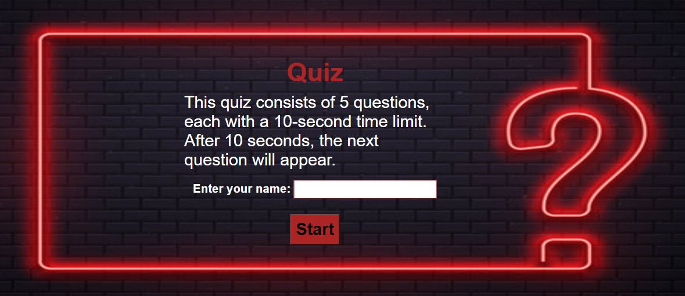
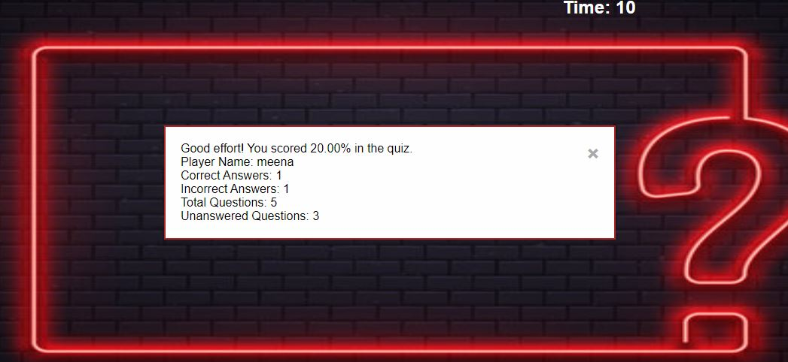
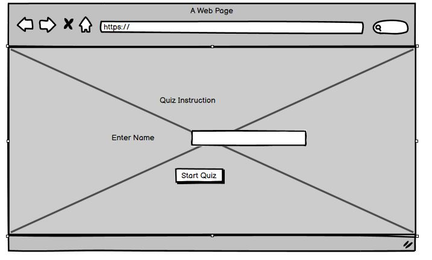
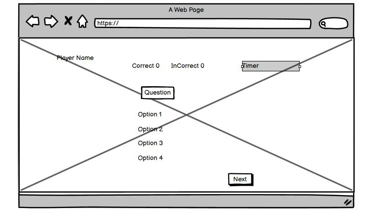
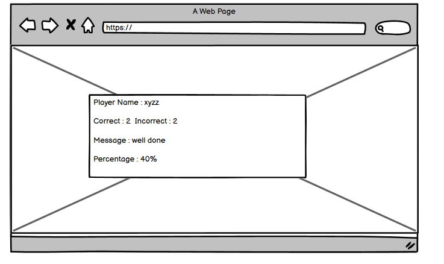
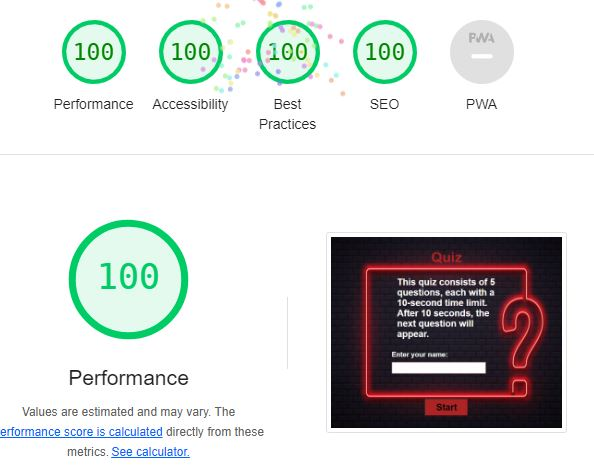

# Purpose of the project #

The purpose of my project is to create a basic quiz app. This quiz has simple programming questions. After 10 seconds, a new question will appear. If the user selected the option within 10 seconds, he should click on the next button for the next question. After you submit the quiz results, a message will appear.

# User Story #

## home ##
As a user, I want to view the quiz instructions, begin the quiz, and then view the results afterward.

# Feature #

## home ##

1. StartQuiz: UserName is mandortary before start the quiz.
2. Option: User can select the any 1 option on the behalf of the question.
3. NextButton: is apperaing the next question and so on.
4. Timer: Each question contain 10 seconds, after 10 seconds next will be appear.
5. Submit: Button: When the quiz end user click on the submit button result should be appear.
6. Timer: When the timer ended in last question result pop-up automatically appear.

# Typography and colorscheme #

## Font Family: ##

The 'Lato' font family, a sans-serif typeface, has been selected for use across the quiz project.
Font Colors:
The color scheme for text is primarily orange, red, gray and white.

# Wireframe #

# Technologies #

**HTML**

1. I used html to develop the basic structure.
   
**Javascript** 

1. JavaScript is utilized to add interactivity and dynamic behavior to web pages.
   
**CSS**

1. I used CSS for stling of the Project.
   
**Github**

1. I used to store the code.
   
**CodeAnyWhere**

1. I used codeanywhere to develop the website.

# Testing #

## Code Validation ##
1. No errors in CSS , JS and Html File.
2. https://validator.w3.org/nu/?doc=https%3A%2F%2Fmeena-rathi.github.io%2Fquiz_javascript%2F
3. https://jigsaw.w3.org/css-validator/validator?uri=https%3A%2F%2Fmeena-rathi.github.io%2Fquiz_javascript%2F&profile=css3svg&usermedium=all&warning=1&vextwarning=&lang=en
4. https://jshint.com/

## Test cases ##

**Test Cae 1**

| Feature | Expected Outcome | Testing Performed | Result | Pass/Fail |
| --- | --- | --- | --- | --- |
| The Sites link <https://meena-rathi.github.io/quiz_javascript/>|> Link directs the user back to the home page | Clicked link | Home page reloads | Pass |
| Start | Question appear on the screen | after clicked on the start button | Question dislpay | Pass |
| Player name Text Field | Questions page appear | clicked on the start button | Question Display | Pass |
| Player name Text Field | Show Error space are not allowed | clicked on the start button  | spaces are not allowed | Pass |
| Player name Text Field | player name is required | clicked on the start button  | Player Name is reqired | Pass |

**Test case2**
| Feature | Expected Outcome | Testing Performed | Result | Pass/Fail |
| --- | --- | --- | --- | --- |
| The Sites link <https://meena-rathi.github.io/quiz_javascript/>|> Link directs the user back to the home page | Clicked link | Home page reloads | Pass |
| Start | Question appear on the screen | after clicked on the start button | Question dislpay | Pass |
| Question | Next Question should be appear| When the timer out (10 Seconds) in pervious quetsion | New question automatically appear after 10 second time out | Pass |
|

**Test case3**
| Feature | Expected Outcome | Testing Performed | Result | Pass/Fail |
| --- | --- | --- | --- | --- |
| The Sites link <https://meena-rathi.github.io/quiz_javascript/>|> Link directs the user back to the home page | Clicked link | Home page reloads | Pass |
| Start | Question appear on the screen | after clicked on the start button | Question dislpay | Pass |
| Next | Click to Next button for next Question | When the user select the option with in 10 second | after clicking the next button new quetsion should be appear. | Pass |
| Counter | Correct or incorrect counter increment on the behald of user selection option | Either user select the correct or incorrect option | Correct or incorrect counter should be increment | Pass |
| Submit | Result pop should be shows the result | Clicked on the submit button | Result pop up appear appear | Pass |

# Fixed Bugs #

| No | Bug | How I solved the issue |
| :--- | :--- | :--- |
| 1 | The time calculation for each question is not accurate. | I allocated 10 seconds for each question.|
| 2 | There is an issue with player name validation as it doesn't display an error.| I implemented if and elseif conditions to show the error.|
| 3 | The CSS alignment was not correct. |  I fixed it by adjusting the styles in the style.css file. |
| 4 | There was a problem with the counter incrementing when the user changed the option. | I resolved this by ensuring that once the user selects an option, it cannot be changed.|
| 5 | The submit button was not aligned properly. |  I addressed this by setting the CSS for all devices to ensure proper alignment. |

# Supported Screen and browser #
1. The website is compatible with all devices.

# Deployment #
**Github**

1. Locate the GitHub repository you need.
2. Click the down arrow on the "Code" button.
3. Copy the link provided in the dropdown.
4. Open your preferred code editor (like Codeanywhere) and select the directory for the clone.
5. In the terminal, use the command 'git clone' and paste the copied GitHub link.
6. Press 'Enter' to create a local clone of the repository in your chosen directory.

**Github Pages**

1. Open your GitHub account and go to the "Settings" tab of your repository.
2. Choose the "Pages" section, select the main branch, and set the root directory.
3. Once configured, the page will automatically refresh, displaying the deployment URL.
4. https://meena-rathi.github.io/quiz_javascript/

## Credits ##
1. w3shool
2. <https://www.shecodes.io/athena/43030-how-to-add-hover-effects-to-a-button-in-javascript>
3. https://www.w3schools.com/quiztest/quiztest.asp?qtest=JAVA (Question copied from W3School)
4. <https://www.geeksforgeeks.org/create-a-quiz-app-with-timer-using-html-css-and-javascript/>
5. love maths
6. images from google
