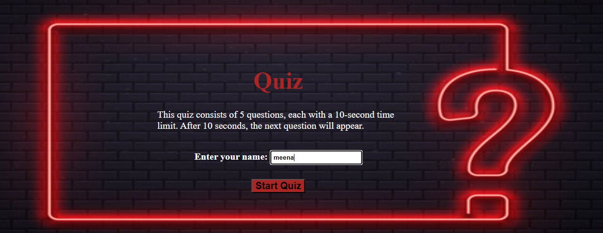
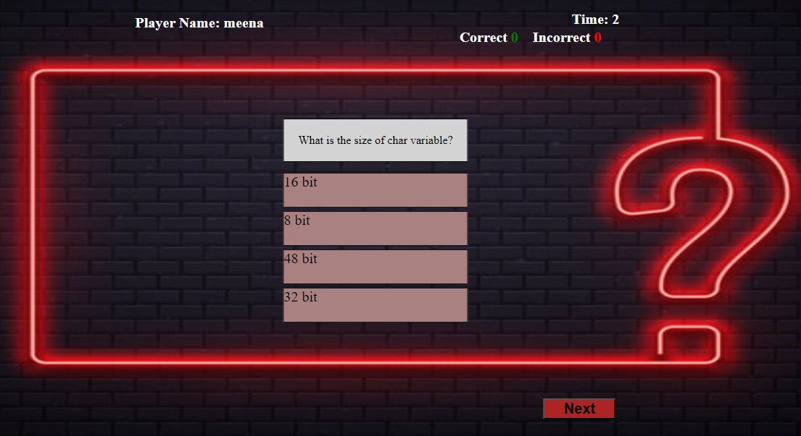
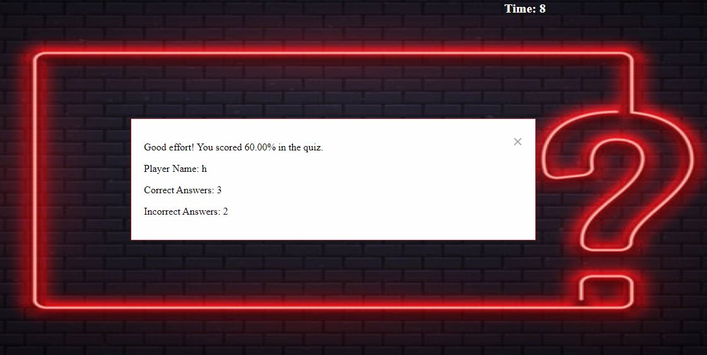

# Purpose of the project #

The purpose of my project is to create a basic quiz app. This quiz contain math and english question.

# User Story #

## home ##
I, as a user, 

# Feature #

## home ##

1. StartQuiz: UserName is mandortary before start the quiz.
2. Option: User can select the any 1 option on the behalf of the question.
3. NextButton: is apperaing the next question and so on.
4. Timer: Each question contain 10 seconds, after 10 seconds next will be appear.
5. Submit: Button: When the quiz end user click on the submit button result should be appear.
6. Timer: When the timer ended in last result pop-up automatically appear.

# Typography and colorscheme #

## Font Family: ##

The 'Lato' font family, a sans-serif typeface, has been selected for use across the quiz project.
Font Colors:
The color scheme for text is primarily green and gray.

# Wireframe #

# Technologies #

**HTML**

1. I used html to develop the basic structure.
**Javascript** 

1. JavaScript is utilized to add interactivity and dynamic behavior to web pages.
**CSS**

1. I used CSS for stling of the Project.
**Github**

1. I used to store the code.
**CodeAnyWhere**

1. I used codeanywhere to develop the website.

# Testing #

**Code Validation**
1. No errors in CSS and Html File.

# Deployment #
**Github**

1. Locate the GitHub repository you need.
2. Click the down arrow on the "Code" button.
3. Copy the link provided in the dropdown.
4. Open your preferred code editor (like Codeanywhere) and select the directory for the clone.
5. In the terminal, use the command 'git clone' and paste the copied GitHub link.
6. Press 'Enter' to create a local clone of the repository in your chosen directory.
**Github Pages**

1. Open your GitHub account and go to the "Settings" tab of your repository.
1. Choose the "Pages" section, select the main branch, and set the root directory.
2. Once configured, the page will automatically refresh, displaying the deployment URL.
3. https://meena-rathi.github.io/quiz_javascript/
