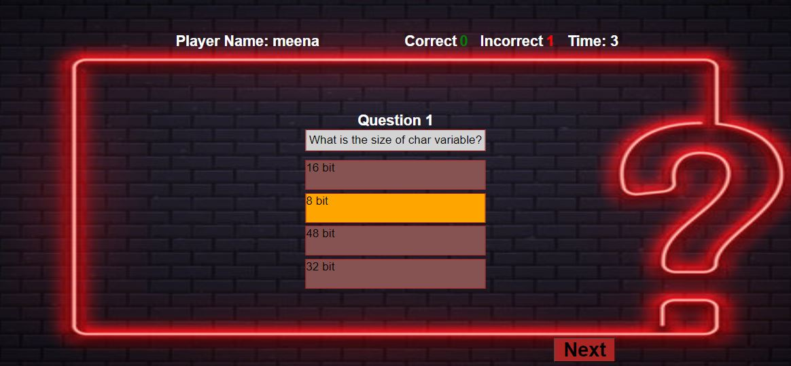

# Purpose of the project #

The purpose of my project is to create a basic quiz app. This quiz contains the basic programming question each question has 10 second time after 10 10 new question will appear. if the the user has select the option with 10 second, the he need to click on the next button for next questions. after submitting the quiz result pop will appear.

# User Story #

## home ##
I, as a user, to see the instruction of quiz and start the quiz and see the result.

# Feature #

## home ##

1. StartQuiz: UserName is mandortary before start the quiz.
2. Option: User can select the any 1 option on the behalf of the question.
3. NextButton: is apperaing the next question and so on.
4. Timer: Each question contain 10 seconds, after 10 seconds next will be appear.
5. Submit: Button: When the quiz end user click on the submit button result should be appear.
6. Timer: When the timer ended in last question result pop-up automatically appear.

# Typography and colorscheme #

## Font Family: ##

The 'Lato' font family, a sans-serif typeface, has been selected for use across the quiz project.
Font Colors:
The color scheme for text is primarily orange, red, gray and white.

# Wireframe #

# Technologies #

**HTML**

1. I used html to develop the basic structure.
   
**Javascript** 

1. JavaScript is utilized to add interactivity and dynamic behavior to web pages.
   
**CSS**

1. I used CSS for stling of the Project.
   
**Github**

1. I used to store the code.
   
**CodeAnyWhere**

1. I used codeanywhere to develop the website.

# Testing #

## Code Validation ##
1. No errors in CSS , JS and Html File.
2. https://validator.w3.org/nu/?doc=https%3A%2F%2Fmeena-rathi.github.io%2Fquiz_javascript%2F
3. https://jigsaw.w3.org/css-validator/validator?uri=https%3A%2F%2Fmeena-rathi.github.io%2Fquiz_javascript%2F&profile=css3svg&usermedium=all&warning=1&vextwarning=&lang=en
4. https://jshint.com/

## Test cases ##

**Test Case: 1**
1. Click on the https://meena-rathi.github.io/quiz_javascript/
2. Enter the Player name.
3. And click on the start quiz.
4. And the questions appear.
5. Browser : chrome
6. Actual result : The page should be redireted to the questions.
7. Excepted result : It should be shows the quetsions.
8. Status : pass

**Test Case: 2**
1. Click on the https://meena-rathi.github.io/quiz_javascript/
2. Enter the Player name.
3. And click on the start quiz without enter the player name.
4. Error the name is required.
5. Browser : chrome
6. Actual result : The page shows error The name is required.
7. Excepted result : It should be shows the name is required..
8. Status : pass

**Test Case: 3**
1. Click on the https://meena-rathi.github.io/quiz_javascript/.
2. After clicking the start button question appear.
3. Select the any one option in 10 second as per question and then next.
4. And the click on the submit button.
5. Browser : chrome
6. Actual result : The result pop Up should be appear.
7. Excepted result : It should be appear result Pop Up.
8. Status : pass

**Test Case: 4**
1. Click on the https://meena-rathi.github.io/quiz_javascript/.
2. After clicking the start button question appear.
3. After 10 seconds next question will appear.
4. If the timer end in last question the user didn't select any option.
5. Browser : chrome
6. Actual result : The result pop Upshould be appear.
7. Excepted result : It should be appear result Pop Up.
8. Status : pass

# Fixed Bugs #
1. Fix submit button for all devices.
2. Set timer for each questions.
3. Submit buttonfix result pop appear.
4. Fixed Images Attributes.
5. Fixed css.
6. Fix Javascript

# Supported Screen and browser #
1. The website is compatible with all devices.

# Deployment #
**Github**

1. Locate the GitHub repository you need.
2. Click the down arrow on the "Code" button.
3. Copy the link provided in the dropdown.
4. Open your preferred code editor (like Codeanywhere) and select the directory for the clone.
5. In the terminal, use the command 'git clone' and paste the copied GitHub link.
6. Press 'Enter' to create a local clone of the repository in your chosen directory.

**Github Pages**

1. Open your GitHub account and go to the "Settings" tab of your repository.
2. Choose the "Pages" section, select the main branch, and set the root directory.
3. Once configured, the page will automatically refresh, displaying the deployment URL.
4. https://meena-rathi.github.io/quiz_javascript/

## Credits ##
1. w3shool
2. <https://www.shecodes.io/athena/43030-how-to-add-hover-effects-to-a-button-in-javascript>
3. https://www.w3schools.com/quiztest/quiztest.asp?qtest=JAVA (Question copied from W3School)
4. <https://www.geeksforgeeks.org/create-a-quiz-app-with-timer-using-html-css-and-javascript/>
5. love maths
